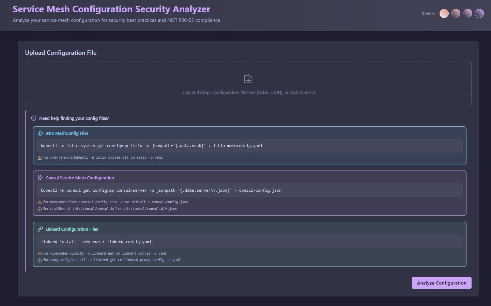
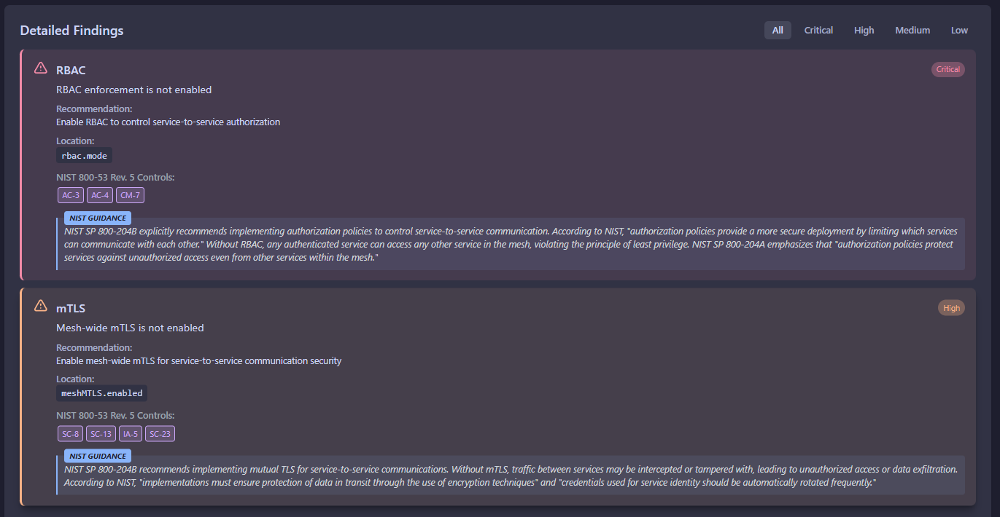

# Service Mesh Configuration Security Analyzer

A local web application for analyzing service mesh configurations against security best practices. Currently supports Istio, Consul, and Linkerd service meshes.

> **Note:** This tool is designed to run locally only. Do not deploy to public cloud environments as it processes potentially sensitive configuration files.





## Features

- Upload and analyze Istio, Consul, and Linkerd service mesh configurations
- Support for various formats including YAML, JSON, and auto-detection of mesh type
- Detailed security checks for over 20 critical security areas across all mesh types
- Severity-based findings with recommendations
- User-friendly web interface with filtering options and theme customization
- Displays specific locations in the configuration that need attention
- NIST 800-53 control mappings for security findings

## Security Checks

### Istio Security Checks

The analyzer evaluates your Istio MeshConfig against the following security best practices:

- **mTLS Configuration**: Ensures mesh-wide mTLS is enabled and set to STRICT mode
- **Certificate Authority**: Validates CA settings and certificate validity durations
- **Peer Authentication**: Verifies proper peer authentication settings
- **Proxy Configuration**: Checks for proper proxy settings, especially privileged mode
- **Secret Discovery Service**: Confirms SDS is enabled for secure certificate distribution
- **Trust Domain**: Validates trust domain settings
- **Authorization Policies**: Checks for proper default deny policy
- **Telemetry & Logging**: Ensures proper telemetry and access logging for security monitoring
- **RBAC**: Verifies RBAC enforcement is enabled
- **Outbound Traffic Policy**: Checks outbound traffic policy mode to prevent data exfiltration

### Consul Security Checks

The analyzer evaluates your Consul configuration against the following security best practices:

- **Service Mesh**: Ensures Consul Connect service mesh is enabled
- **Proxy Security**: Checks proxy settings, especially privileged mode
- **Certificate Authority**: Validates CA provider settings
- **Certificate Security**: Checks certificate TTL settings
- **TLS Security**: Verifies TLS settings for incoming and outgoing connections
- **Access Control**: Ensures ACL system is enabled with proper policy settings
- **Monitoring**: Checks telemetry and metrics configuration
- **Encryption**: Verifies auto-encrypt feature for TLS
- **Configuration Management**: Checks auto-config settings
- **Authorization**: Validates authorization settings for secure configuration
- **Gossip Encryption**: Checks for secure gossip protocol configuration
- **FedRAMP Compliance**: Additional checks specifically for FedRAMP requirements:
  - TLS 1.2+ with FIPS-compliant cipher suites
  - Strict ACL policies with default deny
  - Secure bootstrapping process
  - Audit logging enablement
  - Certificate rotation settings
  - Service sidecar proxy security
  - Proper service-to-service mTLS enforcement

### Linkerd Security Checks

The analyzer evaluates your Linkerd configuration against the following security best practices:

- **TLS Security**: Ensures TLS is enabled and enforced for all service communications
- **Cipher Suites**: Validates the use of strong cipher suites and avoids weak algorithms
- **TLS Versions**: Verifies minimum TLS version is set to 1.2 or higher
- **Service Identity**: Checks that identity features are enabled for proper authentication
- **Certificate Authority**: Validates certificate issuer settings and validity durations
- **Trust Anchors**: Ensures proper trust anchors are configured for identity validation
- **Proxy Configuration**: Checks proxy settings, especially privileged mode and resource limits
- **Policy Enforcement**: Verifies policy enforcement is enabled for authorization
- **Default Deny Policies**: Checks for default deny policies with explicit allows
- **Authentication Policies**: Ensures strict authentication mode is enforced
- **Observability**: Checks for tracing and metrics configurations for security monitoring
- **Destination Rules**: Validates TLS settings in destination rules to prevent plaintext traffic

## Installation

### Standard Installation

1. Clone the repository.

2. Install dependencies:
   ```
   npm install
   ```

3. Start the server:
   ```
   npm start
   ```

4. Open your browser and navigate to:
   ```
   http://localhost:3000
   ```

### Docker Installation

1. Clone the repository.

2. Build the Docker image:
   ```
   docker build -t mesh-config-analyzer .
   ```

3. Run the container:
   ```
   docker run -p 3000:3000 mesh-config-analyzer
   ```

4. Open your browser and navigate to:
   ```
   http://localhost:3000
   ```

## Development

For development with auto-reload:

```
npm run dev
```

## Running Tests

```
npm test
```

## Usage

1. Upload your service mesh configuration file using the web interface
2. The analyzer will automatically detect whether it's an Istio, Consul, or Linkerd configuration
3. Review the findings categorized by severity (Critical, High, Medium, Low)
4. Use the filter options to focus on specific severity levels
5. Review detailed recommendations for each finding
6. Use the theme switcher in the header to customize the UI appearance

## Finding Your Service Mesh Configuration Files

### Istio MeshConfig Files

Istio MeshConfig is typically stored as a Kubernetes ConfigMap. To extract it:

```bash
# Check current MeshConfig
kubectl -n istio-system get configmap istio -o jsonpath='{.data.mesh}' > istio-meshconfig.yaml

# For older versions, you might need to use:
kubectl -n istio-system get cm istio -o yaml > istio-meshconfig.yaml

# For IstioOperator configs:
kubectl -n istio-operator get IstioOperator installed-state -o yaml > istio-operator-config.yaml
```

### Consul Service Mesh Configuration Files

Consul configurations can be found in various locations depending on your setup:

```bash
# For Kubernetes-based Consul:
kubectl -n consul get configmap consul-server -o jsonpath='{.data.server\.json}' > consul-config.json

# For standalone Consul instances:
# Get main configuration
consul config read -name default > consul-config.json

# List all service configurations
consul config list -kind service-defaults

# Get specific service configuration
consul config read -kind service-defaults -name <service-name> > service-config.json

# For local file-based configuration, typically found at:
cat /etc/consul/consul.hcl > consul-config.hcl
# or
cat /etc/consul/consul.d/*.json > consul-config.json
```

### Linkerd Configuration Files

Linkerd configurations can be extracted using the Linkerd CLI or Kubernetes commands:

```bash
# Get main Linkerd configuration
linkerd install --dry-run > linkerd-config.yaml

# For Kubernetes-based installations:
kubectl -n linkerd get cm linkerd-config -o yaml > linkerd-config.yaml

# For proxy configurations:
kubectl -n linkerd get cm linkerd-proxy-config -o jsonpath='{.data.config\.yaml}' > linkerd-proxy-config.yaml

# For identity configurations:
kubectl -n linkerd get secret linkerd-identity-issuer -o yaml > linkerd-identity-config.yaml
```

When in doubt, use the relevant CLI tool's export or dump functionality to get your configuration in a readable format for analysis.

## Sample Configurations

Sample configuration files with various security issues are included in the `samples` directory to help you test the analyzer:

- `sample-meshconfig.yaml` - Istio MeshConfig sample
- `sample-consul-config.json` - Consul configuration in JSON format
- `sample-consul-config.yaml` - Consul configuration in YAML format
- `sample-consul-config.hcl` - Consul configuration in HCL format (note: HCL parsing requires additional setup)
- `sample-linkerd-config.yaml` - Linkerd configuration in YAML format

## Project Structure

```
├── app.js               # Express server and analyzer implementation
├── Dockerfile           # Docker containerization configuration
├── public/              # Static web assets
│   └── index.html       # Web interface with Catppuccin theme system
├── tests/               # Test files
│   └── IstioSecurityAnalyzer.test.js # Unit tests for analyzers
├── samples/             # Sample configuration files
│   ├── sample-meshconfig.yaml      # Istio sample
│   ├── sample-consul-config.json   # Consul JSON sample
│   ├── sample-consul-config.yaml   # Consul YAML sample
│   ├── sample-consul-config.hcl    # Consul HCL sample
│   └── sample-linkerd-config.yaml  # Linkerd YAML sample
└── uploads/             # Temporary directory for file uploads
```

## Key Security Guidelines

### Istio Security Guidelines

When configuring your Istio mesh, follow these key security guidelines:

1. **Always use STRICT mTLS mode** for service-to-service communication
2. **Enable RBAC** for authorization control
3. **Set outbound traffic policy to REGISTRY_ONLY** to prevent unauthorized external communication
4. **Avoid running proxies in privileged mode** unless absolutely necessary
5. **Enable telemetry and access logging** for security monitoring
6. **Use proper certificate management** with SDS enabled and appropriate validity periods
7. **Hold application starts until proxy is ready** to prevent traffic leaks
8. **Use custom trust domains** to isolate identities
9. **Apply a default deny authorization policy** and explicitly allow required traffic
10. **Use external certificate authorities** for production environments

### Consul Security Guidelines

When configuring your Consul service mesh, follow these key security guidelines:

1. **Enable Consul Connect** for service mesh capabilities
2. **Do not allow privileged proxy mode** unless absolutely necessary
3. **Use external certificate authorities** for production environments
4. **Set appropriate certificate TTL values** based on security requirements
5. **Enable TLS verification** for both incoming and outgoing connections
6. **Enable TLS hostname verification** to prevent MITM attacks
7. **Enable and properly configure the ACL system** with a default deny policy
8. **Set specific tokens with appropriate permissions** for agents and defaults
9. **Enable service metrics** for security monitoring
10. **Configure auto-encrypt and auto-config features** for secure operation

### Linkerd Security Guidelines

When configuring your Linkerd service mesh, follow these key security guidelines:

1. **Always enable and enforce TLS** for all service-to-service communication
2. **Use only strong cipher suites** and disable weak/deprecated algorithms
3. **Set minimum TLS version to 1.2 or higher** to prevent known vulnerabilities
4. **Enable service identity features** for proper service authentication
5. **Consider using external certificate authorities** for production environments
6. **Configure shorter certificate validity periods** with regular rotation
7. **Provide proper trust anchors** for certificate validation
8. **Avoid running proxies in privileged mode** unless absolutely necessary
9. **Enable policy enforcement** with default deny and explicit allows
10. **Use strict authentication mode** to require authentication for all traffic
11. **Enable observability features** for security monitoring and incident response
12. **Configure TLS in all destination rules** to prevent plaintext traffic

### FedRAMP Compliance Guidelines

For environments requiring FedRAMP compliance, additional security measures are necessary:

1. **Use TLS 1.2 or higher** with FIPS-compliant cipher suites
2. **Enable gossip encryption** with a strong encryption key
3. **Verify all gossip communication** by enabling both incoming and outgoing verification
4. **Enable audit logging** to capture all security-relevant events
5. **Use secure bootstrapping** to prevent tampering during cluster initialization
6. **Configure certificate rotation** with appropriate periods
7. **Restrict service proxies** to only communicate with localhost services
8. **Enforce sidecar proxies** for all services to ensure mTLS
9. **Set ACL default policy to "deny"** and allow only required operations
10. **Implement regular encryption key rotation** for gossip and TLS certificates

## Security Best Practices Without Direct NIST Mappings

Some security recommendations implemented in the analyzer may not have direct NIST 800-53 control mappings but are still important security best practices. Here's why we recommend these practices:

### Resource Configuration Best Practices

1. **Pinning Container Image Versions**: Using specific versions rather than `:latest` tags ensures predictable behavior and prevents unexpected updates that might introduce vulnerabilities.

2. **Timeout Configuration**: Setting appropriate timeouts prevents resource exhaustion and potential denial of service conditions by limiting how long connections remain open.

3. **Resource Limits**: Configuring CPU and memory limits prevents individual components from consuming excessive resources, which could impact the availability of other services.

### Service Mesh Specific Best Practices

1. **Trust Domain Configuration** (Istio): Setting explicit trust domains isolates identities and prevents potential cross-domain impersonation attacks.

2. **Proxy Initialization Sequencing** (Istio): Ensuring proxies initialize before applications prevents traffic leakage outside the mesh during startup.

3. **Service Account Token Volume Projection** (Linkerd): Using projected service account tokens with expiration enhances security over traditional, non-expiring service account tokens.

4. **Certificate Rotation Frequency**: Setting shorter certificate validity periods limits the exposure window if certificates are compromised.

5. **Auto-Config Security** (Consul): Enabling secure bootstrapping for configuration prevents tampering during initialization.

These practices have evolved from real-world experiences operating service meshes in production environments and represent the collective knowledge of the service mesh community around secure deployments.

## License

[MIT](LICENSE) © Ethan Troy
